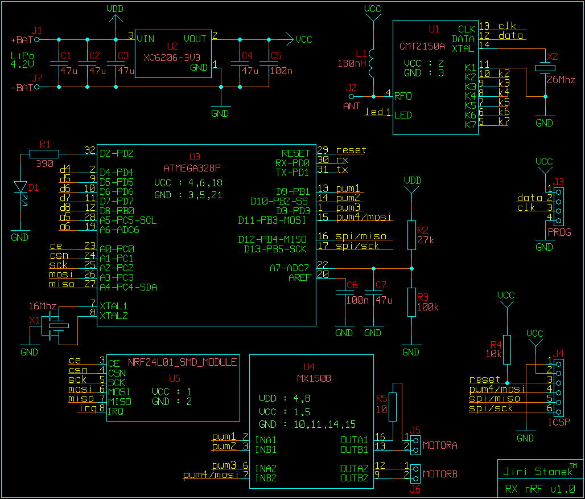
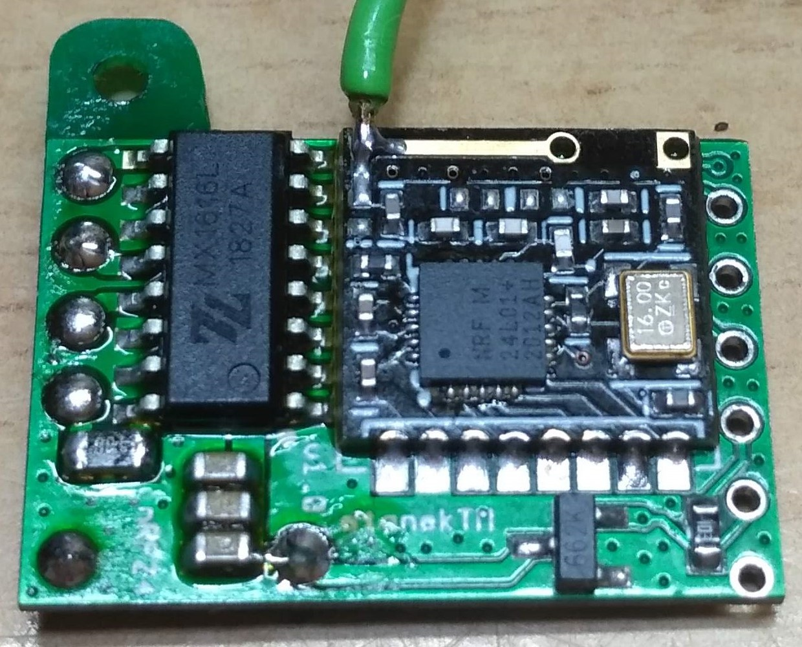
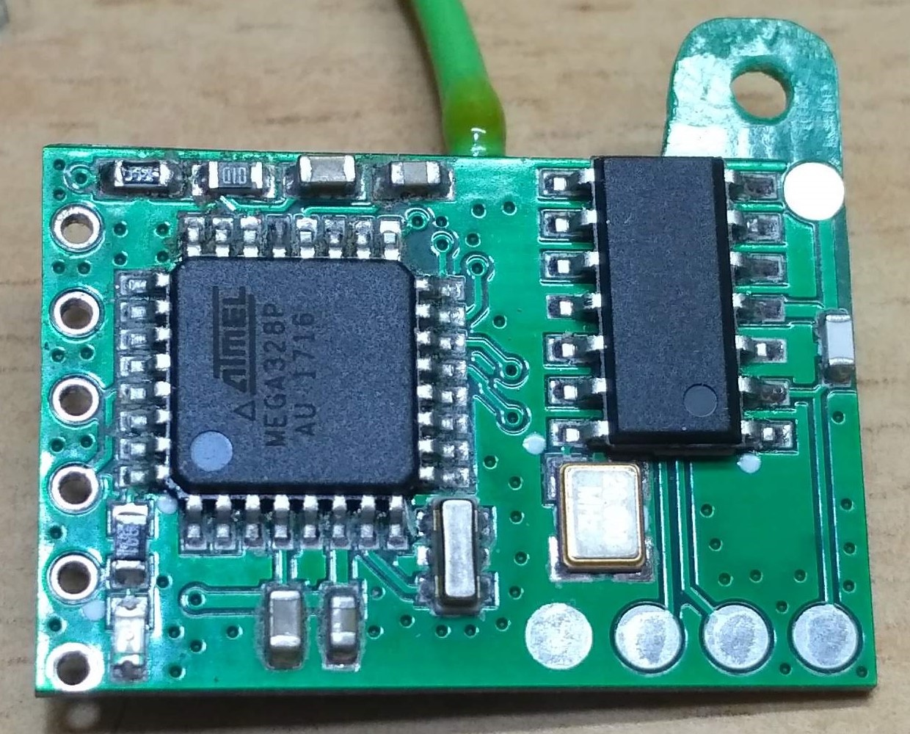
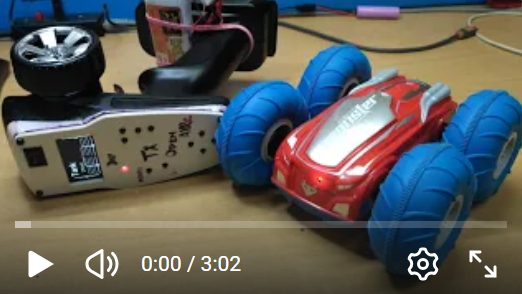

## RC receiver with outputs for motors, servos and telemetry
Hardware includes nRF24L01+ transceiver, ATmega328P/PB processor and motor driver.

The motor driver IC is based on MX1208, MX1508, MX1515, MX1616, MX1919 and others similar, which uses 4x PWM input control signals.

Telemetry sends measured voltage and "fake" RSSI (the nRF24L01+ transceiver does not contain real RSSI and is only a rough counting of lost packets).

The code is Arduino.

### Works with RC transmitters
* [**TX_nRF24_2ch_OLED**](https://github.com/stanekTM/TX_nRF24_2ch_OLED)
* [**TX_nRF24_Xch_LED**](https://github.com/stanekTM/TX_nRF24_Xch_LED)
* [**OpenAVRc**](https://github.com/Ingwie/OpenAVRc_Dev)
* [**Multiprotocol**](https://github.com/stanekTM/TX_FW_Multi_Stanek) from my fork.

### RC receiver specification
* Operating Voltage: 3.3V - 6.0V (target typically 4.2V, 1S LiPo)
* Working current of the motor driver MX1508: 1.5A (peak current up to 2.5A)

### RC receiver configuration manual in the "Config.h" file
* Setting a unique address (5 bytes number or character)
* RF communication channel setting
* Setting the maximum nominal battery voltage
* Setting the minimum battery voltage for alarm
* Servo and motor output selection
* Setting the number of servo channels
* Setting the motor reaction point. Prevents initial rotor magnetic resistance
* Setting the maximum motor power. Suitable for RC transmitters without endpoint setting
* Brake setting
* Pin settings specific to my PCB. Do not use unless you know what you are doing!

### LED mode
* Normal mode, LED is lit
* If the RC receiver battery is low, the LED blink at 0.3s interval
* If we lose RF data for 1 second, the LED blink at 0.1s interval (fail-safe)

### Arduino pins
```
Servo pins:
D2  - servo 1
D3  - servo 2/motor 2/1
D4  - servo 3
D5  - servo 4/motor 1/1
D6  - servo 5/motor 1/2
D7  - servo 6
D8  - servo 7
D9  - servo 8
D10 - servo 9
D11 - servo 10/motor 2/2
D12 - servo 11
D13 - servo 12

A5  - LED
A7  - telemetry analog input RX battery

nRF24L01+:
A0  - CE
A1  - CSN
software SPI:
A2  - SCK
A3  - MOSI
A4  - MISO
```
### Micro RC receiver
<a href="https://youtu.be/E0pgMNPuYU4"></a>





### RC receiver with tank-arcade mix
<a href="https://youtu.be/AYgY5UkVnUM"></a>

### RC receiver with servo
<iframe width="560" height="315" src="https://www.youtube.com/embed/AYgY5UkVnUM?si=YF3XMGJTFg1ziktR" title="YouTube video player" frameborder="0" allow="accelerometer; autoplay; clipboard-write; encrypted-media; gyroscope; picture-in-picture; web-share" referrerpolicy="strict-origin-when-cross-origin" allowfullscreen></iframe>


<iframe id="ytplayer" type="text/html" width="720" height="405"src="https://youtu.be/AYgY5UkVnUM?si=8jnHKtwW9bc1T8su" frameborder="0" allowfullscreen>

