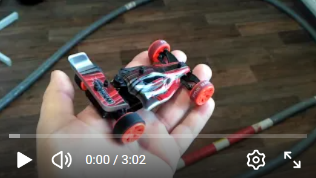

# RC receiver (motor driver, servo driver, telemetry)
Includes nRF24L01+ transceiver, ATmega328P/PB processor, 2x motor controller with brake (e.g. tank-arcade mix) or servo outputs and telemetry.

The motor driver IC is based on MX1208, MX1508, MX1515, MX1616, MX1919 and others similar, which uses 4x PWM input control signals.
The option to adjust the brake is included in the code.

Telemetry sends measured voltage and "fake" RSSI (the nRF24L01+ transceiver does not contain real RSSI and is only a rough counting of lost packets).

The code is Arduino.

### Receiver specification:
* Operating Voltage: 3.3V - 6.0V (target typically 4.2V, 1S LiPo)
* Working current of the motor driver MX1508: 1.5A (peak current up to 2.5A)

### Works with RC transmitters:
* [**TX_nRF24_2ch_OLED**](https://github.com/stanekTM/TX_nRF24_2ch_OLED)
* [**TX_nRF24_4ch_LED**](https://github.com/stanekTM/TX_nRF24_4ch_LED)
* [**OpenAVRc**](https://github.com/Ingwie/OpenAVRc_Dev)
* [**Multiprotocol**](https://github.com/stanekTM/TX_FW_Multi_Stanek) from my fork.

## Micro RC receiver [(motor driver, telemetry, lap reader transponder)](https://github.com/stanekTM/RX_nRF24_Motor_Servo/tree/master/RX_nRF24_2ch_Motor)

[The schematic](https://raw.githubusercontent.com/stanekTM/RX_nRF24_Motor_Servo/master/documents/micro_rx_schema.PNG) and [PCB](https://raw.githubusercontent.com/stanekTM/RX_nRF24_Motor_Servo/master/documents/micro_rx_layout.PNG) is created by a custom version of the open source [PCB Elegance](https://github.com/stanekTM/PCB_Elegance) and manufactured by [JLCPCB](https://jlcpcb.com)

## RC receiver prototype [(motor driver, servo driver, telemetry)](https://youtu.be/jPN5YdQ-3K0?si=AT5yUzox_M3fIWEb)

## RC receiver prototype [(mix tank-arcade motor driver, telemetry)](https://github.com/stanekTM/RX_nRF24_Motor_Servo/tree/master/RX_nRF24_2ch_Motor_Mix_Tank)

